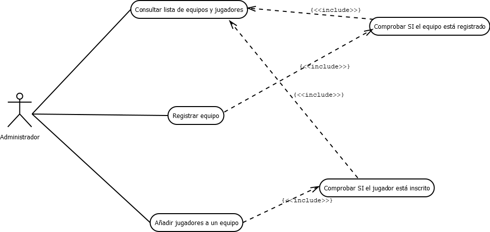
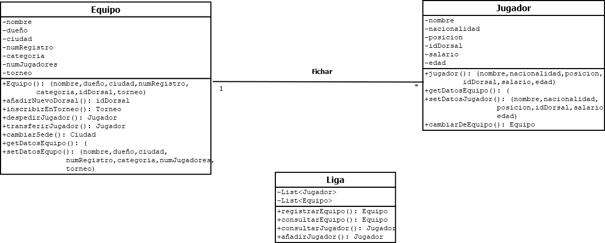

# Tarea_UML_EEDD

# Autor
    Alfonso José Bustos González
    Github: AlfJB
    Enlace al repositorio: 

Actividad dónde aplicaremos el sistema UML para la modelación de estructura y funcionalidad de la gestión de equipos y sus jugadores.

**Diagrama de caso de uso**:

    

    Para realizar el caso de uso debemos identificar a los actores, en este caso correspondería al gestor del equipo, quién interaccionará con nuestra aplicación.

    Las principales interacciones entre usuario y el sistema serían: registrar equipo, añadir jugadores y poder consultar la lista de equipos y jugadores. Para que el sistema funcione y tenga lógica he tomado como imprescindible que para poder añadir un jugador o registrar un equipo hay que comprobar respectivamente si el jugador aparece ya en la lista de jugadores de otro equipo y si el equipo a registrar aparece en la lista de equipos ya existentes, por tanto en ambos casos hay que consultar la lista y esto hace que la dependencia sea la de la imagen. Se tratan de relaciones de inclusión. Si en la lista existe un equipo con el nombre a registrar no se podrá registrar y lo mismo con el jugador.

**Diagrama de clases**:

    

    Para realizar el diagrama de clases debemos identificar las entidades existentes, siendo en este caso equipo y jugador. Por ello como se ve he creado ambas entidades dandole atributos privados que se puedan acceder con los respectivos métodos públicos. Teniendo un constructo con el nombre de la entidad (equipo y jugador) además de otros métodos equivalentes. La relación entre ambas entidades son de 1 a muchos, siendo solamente posible la existencia de 1 equipo para muchos jugadores, ya que un jugador no podría pertenecer a muchos equipos y viceversa. La relación es fichar, siendo los jugadores fichados por un equipo.

    Como controlador he creado la entidad liga, que engloba tanto la entidad jugador como equipo, permitiendo crear los métodos presentados en el ejercicio (registrarEquipo, añadirJugador, consultarEquipo, consultarJugador). Jugador y equipo son listas privadas solo accesibles con los métodos públicos anteriormente nombrados.

**Conclusiones**

En esta actividad he expuesto como he ideado un posible camino para realizar esta estructura. Es cierto que hay muchos caminos válidos para dar con una solución a este problema, lo cuál implica que UML es un método flexible de estructuración y diseño, permitiendo una compresión del problema desde el papel hasta el código.

